# Travel Planning and Booking System

A comprehensive web-based travel platform that integrates various travel-related services into a single, cohesive platform. Built with the MERN stack (MongoDB, Express.js, React.js, Node.js).

## 📋 Table of Contents

- [Overview](#overview)
- [Features](#features)
- [Technology Stack](#technology-stack)
- [Installation](#installation)
- [Usage](#usage)
- [API Documentation](#api-documentation)
- [Database Schema](#database-schema)
- [Screenshots](#screenshots)
- [Team](#team)
- [Contributing](#contributing)
- [License](#license)

## 🎯 Overview

This Travel Planning and Booking System addresses the fragmented nature of travel planning by providing a unified platform where users can search, compare, and book various travel services including tours, accommodations, and transportation. The system offers personalized recommendations based on user preferences, budget, and travel history.

### Problem Statement

Modern travelers face challenges with:
- Using multiple platforms for different travel components
- Time-consuming and fragmented booking processes
- Limited personalization options
- Risk of booking errors and schedule mismatches
- Missing out on deals due to scattered information

### Solution

Our platform provides:
- **Unified Interface**: Single platform for all travel needs
- **Personalized Recommendations**: AI-driven suggestions based on user data
- **Secure Payments**: Multiple payment gateway support
- **Collaborative Planning**: Share travel plans with family and friends
- **Mobile Accessibility**: Responsive design for all devices

## ✨ Features

### User Features
- **Authentication & Authorization**: Secure login/registration with JWT
- **Tour & Accommodation Search**: Advanced filtering and search capabilities
- **Booking Management**: View, modify, cancel, or reschedule bookings
- **Payment Processing**: Secure multi-gateway payment system
- **Reviews & Ratings**: Comment and rate travel experiences
- **Profile Management**: Update personal information and preferences
- **Transaction History**: Complete booking and payment history

### Admin Features
- **User Management**: Create, update, delete user accounts
- **Content Management**: Manage tours and accommodations
- **Booking Oversight**: Monitor and manage all bookings
- **Analytics Dashboard**: View reports and statistics
- **System Administration**: Platform configuration and maintenance

## 🛠 Technology Stack

### Frontend
- **React.js**: User interface development
- **HTML5 & CSS3**: Structure and styling
- **TailwindCSS**: Utility-first CSS framework
- **Reactstrap**: Bootstrap components for React
- **React Router DOM**: Client-side routing
- **Recharts**: Data visualization
- **Remixicon**: Icon library

### Backend
- **Node.js**: Runtime environment
- **Express.js**: Web application framework
- **MongoDB**: NoSQL database
- **Mongoose**: MongoDB object modeling
- **JWT**: Authentication tokens
- **bcryptjs**: Password hashing
- **Multer**: File upload handling

### Development Tools
- **Visual Studio Code**: Code editor
- **Postman**: API testing
- **MongoDB Atlas**: Cloud database hosting
- **Nodemon**: Development server
- **Concurrently**: Run multiple commands

## 🚀 Installation

### Prerequisites
- Node.js (v14 or higher)
- MongoDB Atlas account
- Git

### Clone Repository
```bash
git clone https://github.com/binhbb2204/Travel-App/
cd Travel-App
```

### Backend Setup
```bash
# Navigate to backend directory
cd backend

# Install dependencies
npm install

# Create .env file with the following variables:
MONGODB_URI=your_mongodb_atlas_connection_string
JWT_SECRET_KEY=your_jwt_secret_key
PORT=5000

# Start development server
npm run start-dev
```

### Frontend Setup
```bash
# Navigate to frontend directory
cd frontend

# Install dependencies
npm install

# Start React development server
npm start
```

### Run Both Servers Simultaneously
```bash
# From root directory
npm run dev
```

## 💻 Usage

### User Journey
1. **Registration/Login**: Create account or sign in
2. **Browse Tours/Accommodations**: Use search and filters
3. **View Details**: Check tour/accommodation information and reviews
4. **Book Experience**: Complete booking form and payment
5. **Manage Bookings**: View, modify, or cancel bookings
6. **Leave Reviews**: Rate and review completed experiences

### Admin Operations
1. **Dashboard Access**: Login with admin credentials
2. **User Management**: Monitor and manage user accounts
3. **Content Management**: Add, update, or remove tours/accommodations
4. **Booking Oversight**: Monitor all platform bookings
5. **Analytics**: View reports and system statistics

## 🔌 API Documentation

### Authentication Endpoints
```
POST /api/auth/register - User registration
POST /api/auth/login - User login
```

### User Endpoints
```
GET /api/users - Get all users (admin)
GET /api/users/:id - Get single user
PUT /api/users/:id - Update user
DELETE /api/users/:id - Delete user
```

### Tour Endpoints
```
GET /api/tours - Get all tours
GET /api/tours/:id - Get single tour
POST /api/tours - Create tour (admin)
PUT /api/tours/:id - Update tour (admin)
DELETE /api/tours/:id - Delete tour (admin)
GET /api/tours/search - Search tours with filters
GET /api/tours/featured - Get featured tours
```

### Booking Endpoints
```
POST /api/bookings/tours - Create tour booking
GET /api/bookings/tours - Get all tour bookings
GET /api/bookings/tours/:id - Get single booking
PUT /api/bookings/tours/:id - Update booking
DELETE /api/bookings/tours/:id - Delete booking
```

### Comment Endpoints
```
POST /api/comments/:tourId - Create comment
GET /api/comments/:tourId - Get tour comments
PUT /api/comments/:commentId - Update comment (like/edit)
DELETE /api/comments/:commentId - Delete comment
```

## 🗄 Database Schema

### Collections Overview
The system uses 6 main MongoDB collections:

1. **Users**: User account information
2. **Tours**: Tour listings and details
3. **Accommodations**: Accommodation listings
4. **TourBookings**: Tour booking records
5. **AccommodationBookings**: Accommodation booking records
6. **Comments**: Reviews and ratings

### Key Relationships
- Users ↔ Bookings (userId reference)
- Tours ↔ Comments (tourId reference)
- Users ↔ Comments (userId reference)
- Comments ↔ Comments (parentId for replies)

## 📱 Screenshots

### Main Interface
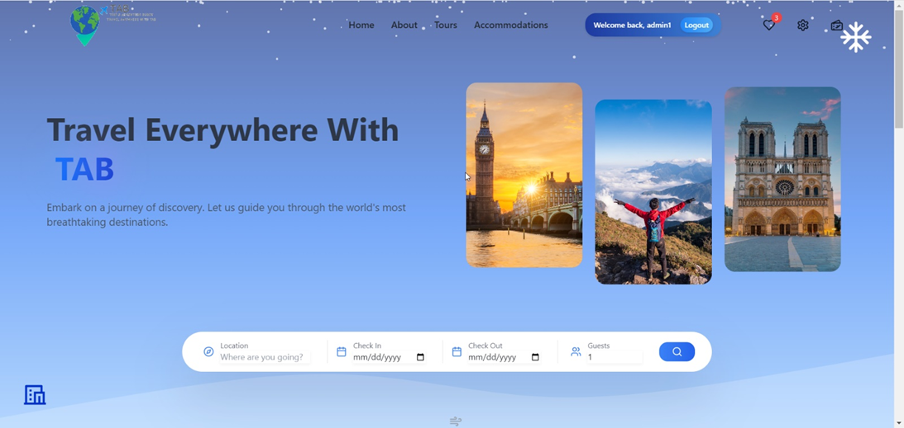

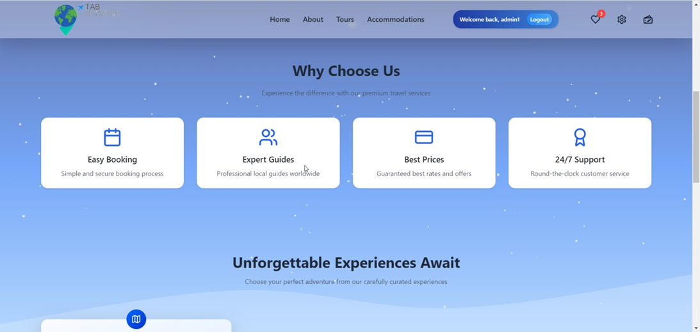

### User Authentication
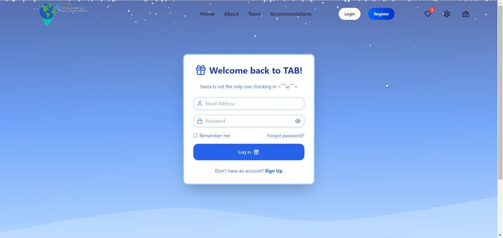

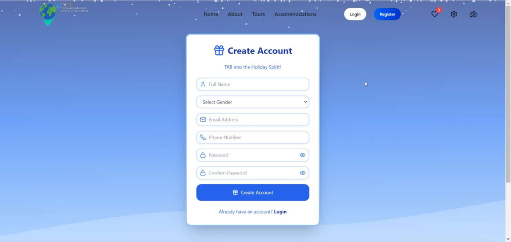

### Core Features
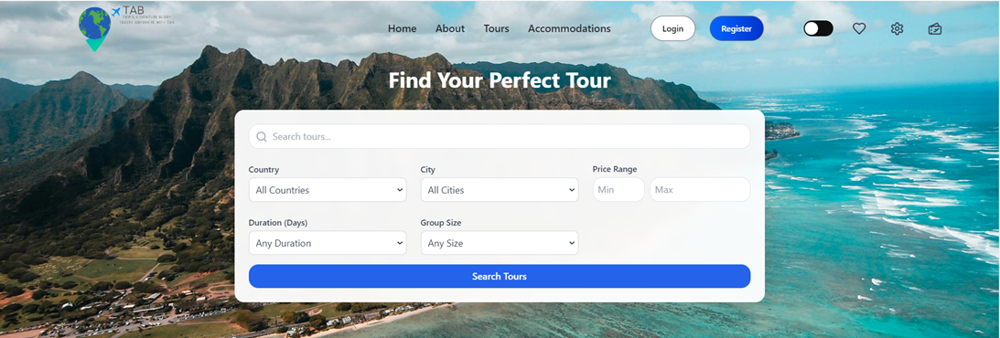

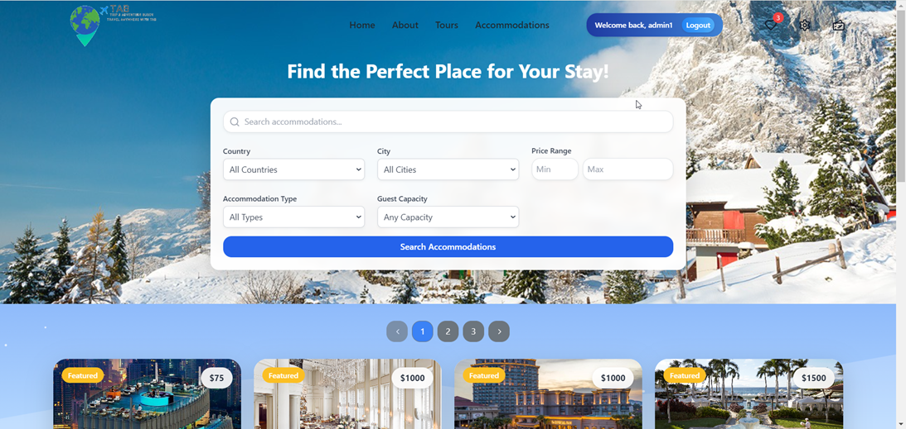

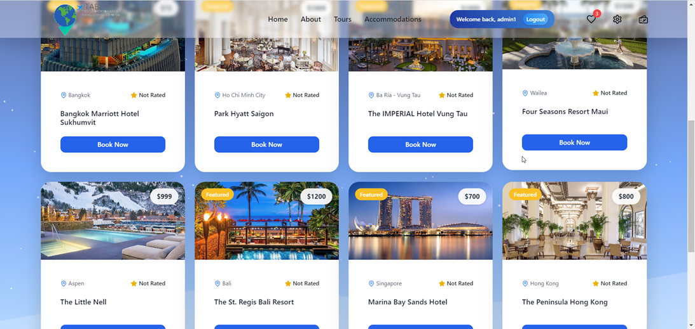

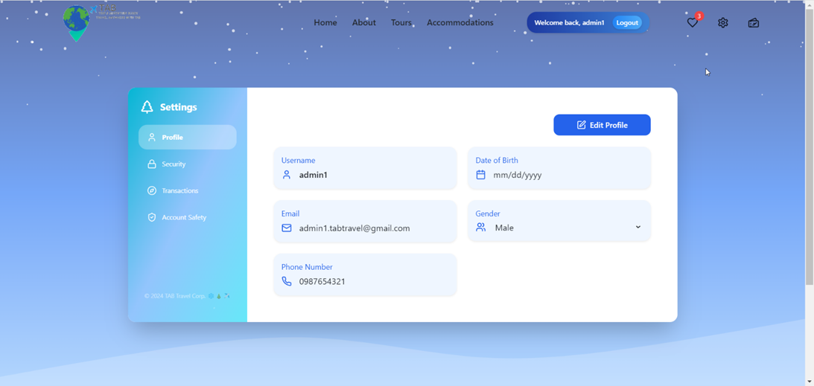

### Booking Process
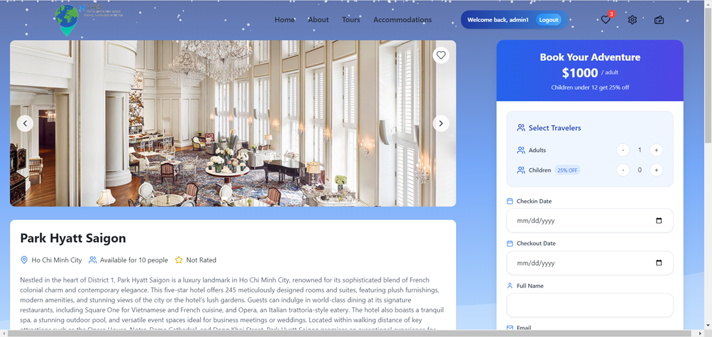

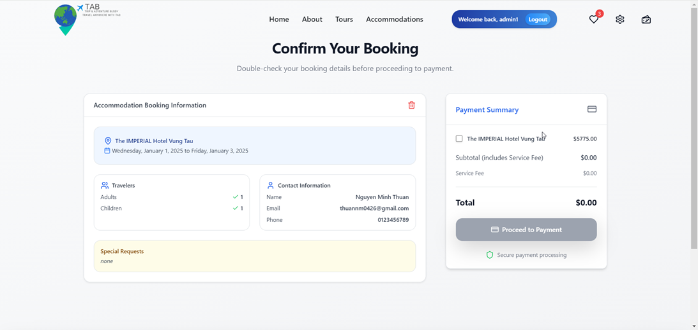

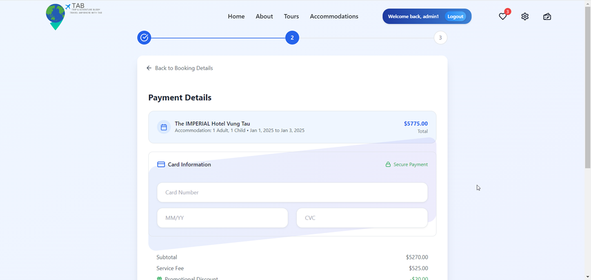

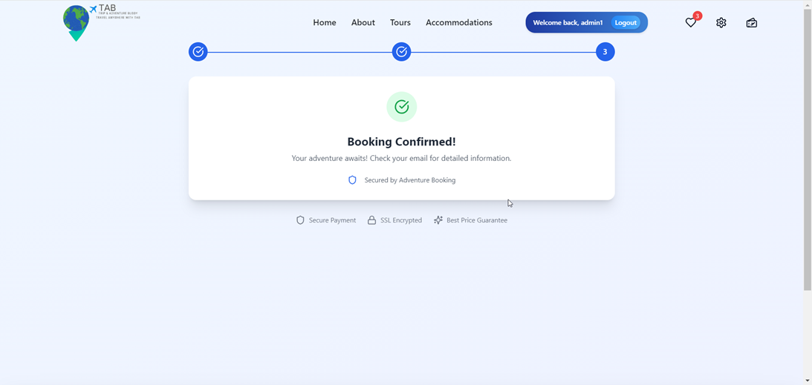

### Admin Panel
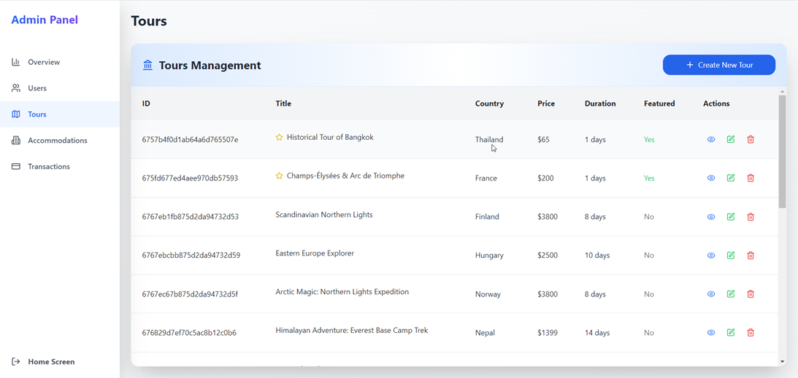

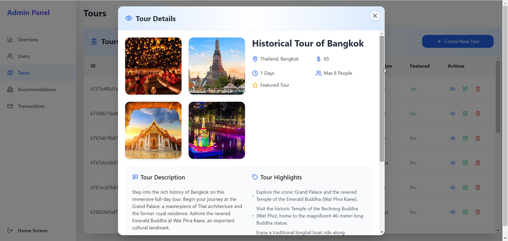

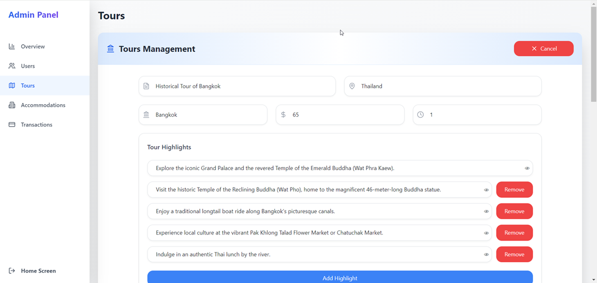

## 👥 Team

**Group 03 - Travel Planning and Booking System**

| Name | Student ID | Role |
|------|------------|------|
| Trần Thanh Bình | ITCSIU22255 | Project Manager, Developer & System Analyst |
| Hoàng Thiên Ân | ITCSIU22248 | Developer & System Analyst |
| Nguyễn Minh Thuận | ITCSIU22269 | Developer & System Analyst |

**Institution**: Vietnam National University - Ho Chi Minh City, International University  
**Course**: Software Engineering (IT076IU)  
**Instructor**: Assoc. Prof. Nguyen Thi Thuy Loan

## 🚧 Development Methodology

The project follows a hybrid approach combining:
- **Waterfall Model**: Structured phases for requirements, design, implementation, and testing
- **Agile Methodology**: Short sprints and iterative development within each phase

### Development Phases
1. **Planning & Preparation** (Week 1-2)
2. **Conceptual Design** (Week 3-4)
3. **Implementation** (Week 5-12)
4. **Testing & Debugging** (Week 13)
5. **Completion & Presentation** (Week 14)

## 🎯 Future Enhancements

### Planned Improvements
- **AI-Powered Recommendations**: Machine learning algorithms for better personalization
- **Mobile Application**: Native mobile app development
- **Advanced Analytics**: Predictive analytics for user preferences
- **Expanded Integrations**: More travel service provider partnerships
- **Real-time Features**: Live chat support and notifications
- **Multi-language Support**: Internationalization capabilities

### Current Limitations
- Dependency on third-party APIs for real-time data
- Limited advanced search filters
- Mobile responsiveness improvements needed
- Performance optimization for large datasets

## 🤝 Contributing

1. Fork the repository
2. Create a feature branch (`git checkout -b feature/AmazingFeature`)
3. Commit your changes (`git commit -m 'Add some AmazingFeature'`)
4. Push to the branch (`git push origin feature/AmazingFeature`)
5. Open a Pull Request

## 📄 License

This project is developed as part of academic coursework at Vietnam National University - Ho Chi Minh City, International University.

## 🔗 External Links

- **GitHub Repository**: [https://github.com/binhbb2204/Travel-App/](https://github.com/binhbb2204/Travel-App/)
- **MongoDB Database**: Hosted on MongoDB Atlas
- **Inspiration**: Booking.com, Traveloka, Expedia

## 📞 Support

For support and inquiries, please contact the development team through the GitHub repository or university channels.

---

*This project demonstrates the effective implementation of modern web development practices and the MERN stack to solve real-world travel planning challenges.*
